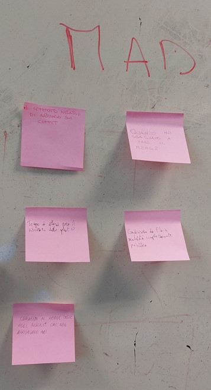

## Indice

1. [**Introduzione**](#1-introduzione)
2. [**Modello di dominio**](#2-modello-di-dominio)
3. [**Requisiti specifici**](#31-requisiti-specifici)
4. [**System design**](#4-System-design)
6. [**Riepilogo dei test**](#6-riepilogo-dei-test)
7. [**Manuale Utente**](#7-manuale-utente)
8. [**Processo di sviluppo e organizzazione del lavoro**](#8-processo-di-sviluppo-e-organizzazione-del-lavoro)
9. [**Analisi retrospettiva**](#9-analisi-retrospettiva)


# 1. Introduzione

**Battleship** è un gioco da tavola diffuso in tutto il mondo. Nella nostra versione, implementata in Java, il giocatore deve cercare di colpire e affondare tutte le navi posizionate sulla griglia da un sistema automatico.

Il giocatore, prima di iniziare una partita, può scegliere la dimensione della griglia. Avrà a disposizione tre possibili scelte:
- standard: griglia di dimensione 10x10;
- large: griglia di dimensione 18x18;
- extralarge: griglia di dimensione 26x26.


Il giocatore può impostare un livello di difficoltà scegliendo tra facile, medio o difficile. Ad ogni livello è associato un numero di colpi che l'utente può fallire, terminati i quali viene conclusa la partita. Inoltre, il giocatore ha anche possibilità di dichiarare un numero di colpi personalizzato. Ovviamente l’utente può tenere sotto controllo i tentativi già falliti e quelli rimanenti. 

Il giocatore vince la partita se riesce a colpire e affondare tutte le navi. Durante l’esecuzione del gioco, l’utente può decidere di visualizzare la griglia vedendo tutte le navi posizionate. Ha inoltre la possibilità di scegliere un tempo di gioco massimo, al termine del quale perderà se non avrà colpito e affondato tutte le navi. Ovviamente il giocatore può vedere il tempo trascorso il tempo rimanente.


**Battleship**  è stata realizzata durante il corso di [INGEGNERIA DEL SOFTWARE](https://github.com/softeng2223-inf-uniba) AA 2022-2023 dal gruppo **Floyd** composto da:

- [Giovanna Antida De Pascale](https://github.com/giovyyy)
- [Donato Boccuzzi](https://github.com/Donatooooooo)  
- [Paolantonio Di Grassi](https://github.com/paolantoniodigrassi)  
- [Martina Capone](https://github.com/Martycap)

[Torna all'indice](#indice)

# 2. Modello di dominio


[Torna all'indice](#indice)

# 3. Requisiti specifici

## 3.1 Requisiti funzionali

### Requisito funzionale 1 : Mostrare l'help con elenco comandi
Come giocatore voglio mostrare l'help con elenco comandi. Al comando 
> `/help` o invocando l'app con flag `--help` o `-h`  

il risultato è una descrizione concisa, che normalmente appare all'avvio del programma, seguita dalla lista di comandi disponibili, uno per riga, come da esempio successivo:
- /facile         Imposta a 50 il numero massimo di tentativi falliti.
- /medio          Imposta a 30 il numero massimo di tentativi falliti.
- /difficile      Imposta a 10 il numero massimo di tentativi falliti.
- /facile *numero*  Imposta al numero in input il numero massimo di tentativi falliti.
- /medio *numero* Imposta al numero in input il numero massimo di tentativi falliti.
- /difficile *numero* Imposta al numero in input il numero massimo di tentativi falliti.
- /tentativi *numero* Imposta a numero in input il numero massimo di tentativi falliti.
- /mostralivello  Visualizza  il livello di gioco e il numero massimo di tentativi falliti.
- /mostratentativi Visualizza il numero massimo di tentativi falliti.
- /mostranavi Visualizza i tipi e il numero di navi.
- /standar Imposta a 10x10 la dimensione della griglia.
- /large Imposta a 18x18 la dimensione della griglia.
- /extralarge Imposta a 26x26 la dimensione della griglia.
- /tempo *numero* Imposta a numero in input il numero di minuti a disposizione.
- /mostratempo Visualizza il numero di minuti trascorsi e il numero di minuti disponibili.
- /gioca Inizio di una nuova partita.
- /svelagriglia Svela la griglia con le navi posizionate.
- /mostragriglia Visualizza i tentativi effettuati, i tentativi falliti e il massimo dei tentativi falliti.
- /help Visualizza questa guida.
- /esci Termina l'applicazione.
- /abbandona Abbandona la partita.

### Requisito funzionale 2 : Chiudere il gioco.
 Come giocatore voglio chiudere il gioco. Al comando 
 > `/esci`  
 
 l'applicazione chiede conferma

- se la conferma è positiva, l'applicazione si chiude restituendo il controllo al sistema operativo 
- se la conferma è negativa, l'applicazione si predispone a ricevere nuovi tentativi o comandi

### Requisito funzionale 3 : Impostare il livello di gioco.
Come giocatore voglio impostare il livello di gioco per variare il numero massimo di tentativi sbagliati. Al comando 
> `/facile` 

l’applicazione risponde con OK e imposta a 50 il numero massimo di tentativi falliti. Al comando 
> `/medio` 

l’applicazione risponde con OK e imposta a 30 il numero massimo di tentativi falliti. Al comando 
> `/difficile` 

l’applicazione risponde con OK e imposta a 10 il numero massimo di tentativi falliti.


### Requisito funzionale 4 : Impostare il numero di tentativi falliti per livello.
Come giocatore voglio impostare il numero massimo di tentativi falliti per livello di gioco. Al comando 
> `/facile numero` 

l’applicazione risponde con OK e imposta a numero il numero massimo di tentativi falliti. Al comando 
> `/medio numero` 

l’applicazione risponde con OK e imposta a numero il numero massimo di tentativi falliti. Al comando 
> `/difficile numero` 

l’applicazione risponde con OK e imposta a numero il numero massimo di tentativi falliti.


### Requisito funzionale 5 : Mostrare il livello e il numero di tentativi.
Come giocatore voglio mostrare il livello di gioco e il numero massimo di tentativi falliti. Al comando 
 > `/mostralivello` 
 
 l’applicazione risponde visualizzando il livello di gioco e il numero massimo di tentativi falliti. 


### Requisito funzionale 6 : Mostrare i tipi di nave e il numero.
Come giocatore voglio mostrare i tipi di nave e il numero. Al comando 
 > `/mostranavi` 
 
 l’applicazione risponde visualizzando, per ogni tipo di nave, la dimensione in quadrati e il numero di esemplari da affondare:

- Cacciatorpediniere ⊠⊠       esemplari: 4
- Incrociatore       ⊠⊠⊠     esemplari: 3  
- Corazzata          ⊠⊠⊠⊠   esemplari: 2  
- Portaerei          ⊠⊠⊠⊠⊠ esemplari: 1  

### Requisito funzionale 7: Iniziare una nuova partita.
Come giocatore voglio iniziare una nuova partita. Al comando 
> `/gioca`  

se nessuna partita è in corso l'applicazione imposta causalmente le navi, in orizzontale o in verticale, mostra la griglia vuota e si predispone a ricevere il primo tentativo o altri comandi.


### Requisito funzionale 8 : Svelare la griglia. 
Come giocatore voglio svelare la griglia con le navi posizionate. Al comando 
> `/svelagriglia`

 l’applicazione risponde visualizzando, la griglia e tutte le navi posizionate.


### Requisito funzionale 9 : Impostare il numero massimo di tentativi.
Come giocatore voglio impostare direttamente il numero massimo di tentativi che si possono fallire. Al comando 
> `/tentativi numero`
 
l’applicazione risponde con OK e imposta a numero il numero massimo di tentativi falliti.


### Requisito funzionale 10 : Mostrare il numero massimo di tentativi falliti.
Come giocatore voglio mostrare il numero massimo di tentativi falliti. Al comando 
> `/mostratentativi ` 

l’applicazione risponde visualizzando il numero massimo di tentativi falliti. 


### Requisito funzionale 11 : Impostare la taglia della griglia.
Come giocatore voglio impostare la taglia della griglia. Al comando 
>`/standard`

l’applicazione risponde con OK e imposta a 10x10 la dimensione della griglia (è il default). Al comando 
> `/large` 

l’applicazione risponde con OK e imposta a 18x18 la dimensione della griglia. Al comando 
> `/extralarge` 

l’applicazione risponde con OK e imposta a 26x26 la dimensione della griglia.  


### Requisito funzionale 12 : Impostare il tempo di gioco.
Come giocatore voglio impostare il tempo di gioco. Al comando 
> `/tempo numero` 

l’applicazione risponde con OK e imposta a numero il numero minuti a disposizione per giocare. 


### Requisito funzionale 13 : Mostrare il tempo di gioco.
Come giocatore voglio mostrare il tempo di gioco. Al comando 
> `/mostratempo` 

l’applicazione risponde visualizzando il numero di minuti trascorsi nel gioco e il numero di minuti ancora disponibili.


### Requisito funzionale 14 : Effettuare un tentativo per colpire una nave.
Come giocatore voglio effettuare un tentativo per colpire una nave. 

Digitando una coppia di caratteri separati da un trattino, corrispondenti rispettivamente al numero di riga e alla lettera della colonna, (es. B-4), l’applicazione risponde  
- “acqua” se sulla cella non è posizionata nessuna nave; 
- "colpito" se sulla cella è posizionata una nave; 
- "colpito e affondato" se sulla cella è posizionata una nave ed è l’ultima cella non colpita della nave.

Qualunque sia l’esito del tentativo, l’applicazione mostra la griglia con le navi colpite parzialmente o affondate, il numero di tentativi già effettuati, e il tempo trascorso.  
La partita termina con successo se il tentativo ha affondato l’ultima nave. 
La partita termina con insuccesso se è stato raggiunto il numero massimo di tentativi falliti o se è scaduto il tempo di gioco.  


### Requisito funzionale 15 : Mostrare la griglia con le navi colpite e affondate.
Come giocatore voglio mostrare la griglia con le navi colpite e affondate. Al comando 
> `/mostragriglia` 

l’applicazione risponde visualizzando, la griglia con le navi affondate e le sole parti già colpite delle navi non affondate.   


### Requisito funzionale 16 : Mostrare tentativi effettuati e tentativi falliti.
Come giocatore voglio mostrare il numero di tentativi già effettuati e il numero di tentativi falliti. Al comando 
> `/mostratentativi`

l’applicazione risponde visualizzando il numero di tentativi già effettuati, il numero di tentativi falliti e il numero massimo di tentativi falliti.


### Requisito funzionale 17 : Abbandonare una partita.
Come giocatore voglio abbandonare una partita. Al comando 
> `/abbandona`

l'applicazione chiede conferma  
-	se la conferma è positiva, l’applicazione risponde visualizzando sulla griglia la posizione di tutte le navi e si predispone a ricevere nuovi comandi;  
-	se la conferma è negativa, l'applicazione si predispone a ricevere nuovi tentativi o comandi. 

## 3.2 Requisiti non funzionali

RNF1: il container docker dell’app deve essere eseguito da terminali che supportano Unicode con encoding UTF-8 o UTF-16.

#### **Elenco di terminali supportati**

Linux:

- terminal

Windows:

- Powershell  
- Git Bash (in questo caso il comando Docker ha come prefisso winpty; es: winpty docker -it ....)

#### Comando per l’esecuzione del container

Dopo aver eseguito il comando docker pull copiandolo da GitHub Packages, Il comando Docker da usare per eseguire il container contenente l’applicazione è:  

```
docker run --rm -it ghcr.io/softeng2223-inf-uniba/battleship-floyd:latest
```
[Torna all'indice](#indice)

# 4. System design

Questa sezione non è totalmente redatta perchè si tratta di un progetto di piccole dimensioni per tanto il gruppo dopo un'analisi del problema ha opportunamente deciso che non avrebbe avuto senso esplicitare un design del sistema. 

Anche se il software non è su larga scala e non ha una architettura complessa, abbiamo realizzato il diagramma dei package per completezza.

## Diagramma dei package


Il package ```it.uniba.app``` dipende dal package FloydGame che contiene gli altri package:

- `Boundaries`, contenente le classi che si occupano di gestire l'interazione con l'utente;  
- `Controller`, contenente le classi che gestiscono la logica di controllo del gioco;  
- `GameTable`, contenente le classi che memorizzano e gestiscono le tabelle di gioco;  
- `Ships`, contenente le classi che definiscono le navi del gioco;  
- `UserExceptions`, contenente le eccezioni personalizzate per la gestione degli errori;  
- `Util`, contenente le classi per la gestione dei comandi del gioco.

[Torna all'indice](#indice)

## Decisioni prese in riferimento ai principi OO Design

Durante lo sviluppo di *Battleship*  abbiamo prestato particolare attenzione all'applicazione dell'information hiding. Abbiamo nascosto i dettagli interni delle classi, permettendo alle altre solo di accedere tramite dei metodi pubblici. 

Questo approccio promuove l'**incapsulamento** e garantisce una corretta separazione delle responsabilità.
Ogni classe del gioco, come ad esempio GameTable, Ships, ShipMap, Difficulty e GameTimer, è stata progettata per nascondere i dettagli interni e fornire metodi pubblici appropriati per interagire con le funzionalità offerte dalla classe stessa. Questa strategia permette di avere un codice più mantenibile, consentendo modifiche future senza impattare sulle componenti esterne.

La **modularità** del codice e la riduzione della **duplicazione** sono stati obiettivi chiave nella progettazione del videogioco della Battaglia Navale. 
Abbiamo cercato di creare classi e metodi ben strutturati, in modo che eseguano funzioni specifiche e siano riutilizzabili in diversi contesti.  
Per evitare la duplicazione di codice, è stato adottato un approccio di progettazione orientato al riuso. Ad esempio, nella classe ShipMap sono state definite operazioni comuni per la gestione delle navi, promuovendo la riutilizzabilità del codice in diverse parti del gioco.

Nel progetto, non è stata utilizzata l'**ereditarietà** (se non per definire le eccezioni) in quanto non era necessaria per realizzare le funzionalità richieste.
Invece, il **principio di composizione** è stato applicato per creare relazioni tra le classi, consentendo una maggiore flessibilità e un minore accoppiamento. 

Tutte queste scelte sono state fatte in funzione di evitare il **debito tecnico**: abbiamo cercato di ottenere un codice di alta qualità che sia mantenibile nel lungo termine in maniera tale da evitare problemi futuri.

[Torna all'indice](#indice)

# 6. Riepilogo dei test
Di seguito vengono riassunte e spiegate tutte le classi utilizzate per eseguire i casi di test.

## GameTimeControllerTest

La classe `GameTimeControllerTest` è una classe di test per la classe `GameTimeController`. Contiene due metodi di test: `testDisplayGameTimeUnlimited` e `testDisplayGameTimeLimited`.

Il metodo `testDisplayGameTimeUnlimited` verifica il comportamento del metodo `displayGameTime` della classe `GameTimeController` quando il tempo di gioco è **illimitato**. Viene verificato che l'output generato dal metodo corrisponda all'output atteso, che mostra il tempo di gioco come "illimitato" e il tempo trascorso.

Il metodo `testDisplayGameTimeLimited` verifica il comportamento del metodo `displayGameTime` della classe `GameTimeController` quando il tempo di gioco è **limitato**. Viene verificato che l'output generato dal metodo corrisponda all'output atteso, che mostra il tempo trascorso e il tempo rimanente.

Entrambi i metodi utilizzano le asserzioni di *JUnit* per confrontare i due output e segnalare eventuali discrepanze.

## GameTableTest

La classe `GameTableTest` è responsabile del testing della classe `GameTable`, la quale rappresenta una griglia di dimensione variabile all'interno del gioco.
Contiene una serie di metodi di test per verificare il comportamento della classe GameTable in vari casi. 

Alcuni dei test includono:

- **Test delle dimensioni della tabella**: i metodi di test verificano se la dimensione della tabella viene impostata correttamente e se le righe e le colonne hanno i valori attesi.

- **Test dell'impostazione dei bordi**: i metodi di test verificano se i bordi della tabella vengono impostati correttamente con valori specifici.

- **Test per verificare la gestione delle eccezioni**: i metodi di test verificano se l'eccezione `NullTableException` viene sollevata correttamente quando viene passata una tabella nulla.

- **Test per verificare l'impostazione dei valori all'interno della tabella**: i metodi di test verificano se i valori all'interno del perimetro della tabella vengono impostati correttamente.

- **Test per verificare l'impostazione della mappa delle navi**: i metodi di test verificano se la mappa delle navi viene impostata correttamente e se gli stati delle navi sono corretti.

I metodi di test utilizzano gli assert per confrontare i valori attesi con quelli ottenuti durante l'esecuzione dei test.

## TableControllerTest

La classe `TableControllerTest` è responsabile di testare il funzionamento della classe `TableController`.

I test presenti in questa classe coprono diverse situazioni possibili durante il gioco. Ad esempio, ci sono test per verificare il corretto funzionamento quando si colpisce:
- una casella vuota, 
- una casella già colpita, 
- una casella contenente una nave, 
- una casella contenente una nave già colpita
- una casella contenente una nave affondata

Questo garantisce che il controller si comporti correttamente in ogni scenario.

Inoltre, sono presenti test specifici per le caselle agli angoli della tabella. Questi test servono a verificare se il controller gestisce correttamente i colpi sulle caselle negli angoli, che potrebbero avere un comportamento particolare rispetto alle altre caselle.

Infine, la classe `TableControllerTest` include anche test per verificare se una nave è stata affondata correttamente. Questi test verificano che il controller riesca a rilevare quando tutte le caselle di una nave sono state colpite e quindi segnalare che la nave è affondata.

## ShipMapTest

La classe `ShipMapTest` è la classe di test per la classe `ShipMap`, utilizzata per verificare il corretto funzionamento dei metodi di questa classe. 

All'interno della classe `ShipMapTest` sono presenti diversi metodi di test che si focalizzano su specifiche funzionalità della classe `ShipMap`. Ad esempio, i metodi `testSetXValues`, `testSetYValues` e `testSetDirectionValues` verificano l'assegnazione corretta dei valori delle coordinate X, Y e della direzione alle navi presenti nella mappa. Inoltre, il metodo `testSetValuesWithInvalidKey` controlla se viene sollevata correttamente una `NullPointerException` nel caso in cui venga fornita una **chiave non valida** durante l'impostazione dei valori.

## ChangingGameDurationExceptionTest

La classe `ChangingGameDurationExceptionTest` è la classe di test per la classe `ChangingGameDurationException`. Questa classe contiene un singolo metodo di test che verifica il corretto funzionamento del metodo `getMessage()` della classe `ChangingGameDurationException`.

Il metodo di test presente nella classe è chiamato `testChangingGameDurationException()`. All'interno di questo metodo, viene utilizzato il metodo `assertThrows()` per verificare che venga generata correttamente un'istanza di `ChangingGameDurationException`. Questo viene fatto tramite l'utilizzo di una *lambda-function* che lancia esplicitamente un'eccezione di tipo `ChangingGameDurationException`.

## DifficultyTest

La classe `DifficultyTest` è una classe di test per la classe `Difficulty` che gestisce la difficoltà del gioco. 

All'interno della classe `DifficultyTest`, sono presenti diversi metodi di test che verificano il corretto funzionamento dei metodi della classe `Difficulty`. Ogni metodo di test si focalizza su una specifica combinazione di difficoltà e tentativi massimi personalizzati.

I metodi di test chiamati `testSetDifficultyFacile`, `testSetDifficultyMedio`, `testSetDifficultyDifficile` e `testSetDifficultyPersonalizzato` verificano che il livello di difficoltà impostato tramite il metodo `setDifficulty` sia corretto. I livelli di difficoltà testati sono "Facile", "Medio", "Difficile" e "Personalizzato", rispettivamente.

I metodi di test chiamati `testSetDifficultyFacileWithMaxAttempts`, `testSetDifficultyMedioWithMaxAttempts`, `testSetDifficultyDifficileWithMaxAttempts` e `testSetDifficultyPersonalizzatoWithMaxAttempts` verificano che il numero di errori massimi impostato tramite il metodo `setDifficulty` sia corretto quando viene specificato un numero personalizzato di tentativi massimi. Ogni metodo di test corrisponde a una specifica combinazione di difficoltà e numero di tentativi massimi.

In ciascun test viene utilizzato il metodo `assertEquals` per confrontare il valore restituito dal metodo di `Difficulty` testato con il valore atteso. Se i valori corrispondono, il test viene considerato superato; altrimenti, viene segnalato un errore.

## GameTimerTest

La classe `GameTimerTest` è progettata per verificare il comportamento e la correttezza della classe `GameTimer`. Questa classe è composta da una serie di test che coprono diversi aspetti del funzionamento del timer di gioco.

In particolare, i test includono la verifica del tempo trascorso, l'incremento del tempo, l'impostazione del tempo rimanente e il reset del tempo trascorso. Questi test consentono di garantire che la classe `GameTimer` funzioni correttamente in diversi scenari di utilizzo.

Ad esempio, il metodo `testGetElapsedTime()` verifica se il tempo trascorso restituito dal timer è zero quando la durata del gioco è impostata su dieci. Allo stesso modo, il metodo `testIncrementElapsedTime()` verifica se l'incremento del tempo viene eseguito correttamente.

Un altro test, come `testSetRemainingTime()`, verifica se il tempo rimanente viene impostato correttamente nel timer. Ci sono anche test che verificano il comportamento del timer quando la durata del gioco è zero o quando viene eseguito il reset del tempo trascorso.

In conclusione, i casi di test sviluppati dal gruppo seguono l'approccio di testing black box, che si concentra principalmente sulla valutazione del comportamento esterno del programma senza prendere in considerazione i dettagli specifici della sua implementazione interna.

[Torna all'indice](#indice)

# 7. Manuale Utente

Su richiesta dell'utente, può essere visualizzato l'help. Il programma risponde mostrando tutti i comandi disponibili con la relativa descrizione.

Di seguito vengono riportati degli screen di esempio.
    OPZIONI:
    -h, --help  Visualizza questa guida. 
    
    COMANDI IN APP:

    - /facile               Imposta a 50 il numero massimo di tentativi falliti. 

    - /medio                Imposta a 30 il numero massimo di tentativi falliti. 

    - /difficile            Imposta a 10 il numero massimo di tentativi falliti. 

    - /facile *numero*      Imposta al numero in input il numero massimo di tentativi falliti. 

    - /medio *numero*       Imposta al numero in input il numero massimo di tentativi falliti. 

    - /difficile *numero*   Imposta al numero in input il numero massimo di tentativi falliti. 

    - /tentativi *numero*   Imposta a numero in input il numero massimo di tentativi falliti. 

    - /mostralivello        Visualizza  il livello di gioco e il numero massimo di tentativi falliti.
  
    - /mostratentativi      Visualizza il numero massimo di tentativi falliti.

    - /mostranavi           Visualizza i tipi e il numero di navi.

    - /standard             Imposta a 10x10 la dimensione della griglia.

    - /large                Imposta a 18x18 la dimensione della griglia.

    - /extralarge           Imposta a 26x26 la dimensione della griglia

    - /tempo *numero*       Imposta a numero in input il numero di minuti a disposizione.

    - /mostratempo          Visualizza il numero di minuti trascorsi e il numero di minuti disponibili.

    - /gioca                Inizio di una nuova partita. 

    - /svelagriglia         Svela la griglia con le navi posizionate.

    - /mostragriglia        Visualizza i tentativi effettuati, i tentativi falliti e il massimo dei tentativi falliti.

    - /help                 Visualizza la guida.

    - /esci                 Termina l'applicazione.  

    - /abbandona            Abbandona la partita.

    - colonna-riga          Si indicano le coordinate della cella da colpire, per esempio "A-1".

### **Schermata Battleship dopo aver avviato il programma**


### **Esecuzione del comando help con utilizzo dei parametri */help*, *-h* o *--help***


### **Esecuzione del comando ```/facile``` (analogo per tutte le difficoltà, con modifica del valore di errori massimi possibili)**


### **Esecuzione del comando ```/facile *numero*``` (analogo per tutte le difficoltà, con modifica del valore di errori massimi possibili in base al numero scritto in input)**


### **Esecuzione del comando ```/tentativi *numero*``` (imposta il livello a personalizzato e modifica il valore di errori massimi possibili in base al numero scritto in input)**


### **Esecuzione del comando ```/mostralivello``` (mostra il livello impostato con il numero di tentativi massimi selezionati**)


### **Esecuzione del comando ```/mostratentativi``` (mostra il numero di errori commessi, il numero massimo di errori e il numero dei turni)**


### **Esecuzione del comando ```/mostranavi```(mostra il numero delle istanze delle navi rimanenti)**


### **Esecuzione del comando ```/standard```(analogo per tutte le dimensioni, con modifica dei valori della dimensione della tabella)**


### **Esecuzione del comando ```/tempo *numero*```(imposta il tempo massimo della durata della partita)**


### **Esecuzione del comando ```/mostratempo```(mostra il tempo trascorso e quello rimanente)**


### **Esecuzione del comando ```/gioca```**


### **Esecuzione del comando ```/svelagriglia```(mostra tutte le navi posizionate)**


### **Esecuzione del comando ```/mostragriglia```(mostra tutte le celle colpite)**


### **Esecuzione del comando ```/esci```(se si da conferma di uscire si ferma l'esecuzione, altrimenti si continua normalmente)**


### **Esecuzione del comando ```/abbandona```(se si da conferma di abbandonare si esce dalla partita corrente, altrimenti si continua normalmente)**


### **Esecuzione del comando ```colonne-righe```(si indicano le coordinate da colpire, per esempio "A-1")**


[Torna all'indice](#indice)


# 8. Processo di sviluppo e organizzazione del lavoro
Il processo di sviluppo della **Battaglia navale** è avvenuto seguendo un approccio *simil-* [***SCRUM***](https://it.wikipedia.org/wiki/Scrum_%28informatica%29). <br><br> 
L'approccio in questione si è evoluto in **3 sprint** di durata variabile, organizzati nel seguente modo:
- I docenti hanno rivestito il ruolo del **Product Owner**. <br>
  La comunicazione ufficiale degli Sprint è avvenuta mediante piattaforma *MS Teams* sia tramite messaggio (ex.: *Definition of Done*) che attraverso file word (ex.: *Sprint backlog, User Stories*)
- La *Definition of Done* definiva lo **Sprint Goal**, ovvero lo scopo da perseguire fino al termine dello Sprint.<br>
- La suddivisione del lavoro è avvenuta in modo flessibile, senza vincoli di ruoli predefiniti, e ogni membro si è autonomamente offerto per svolgere compiti specifici.<br>
- Si è deciso di lavorare secondo la modalità [*Peer review*](https://en.wikipedia.org/wiki/Peer_review), ovvero controllandosi e aiutandosi in maniera del tutto reciproca e spontanea. <br> La divisione del lavoro è avvenuta in speciali incontri di ***Sprint Planning*** che hanno fornito la base di tutti gli sprint. Tuttavia, a seconda delle problematiche riscontrate e degli impegni dei singoli membri del team, ci si è resi comunque disponibili e flessibili per successive ripartizioni/riassegnazioni del lavoro.<br>
- I compiti assegnati sono stati gestiti mediante le *Project Board* messe a disposizione da GitHub.<br>
  Lo stile applicato alle board(s) è lo stile [*Kanban*](https://it.wikipedia.org/wiki/Kanban), composto in questo caso da *5* colonne così organizzate:<br> 
  - **TO DO**, issue non ancora svolte;
  - **IN PROGRESS**, issue in lavorazione;
  - **REVIEW**, issue in attesa di revisione di altri membri del Team;
  - **READY**, issue svolte e revisionate dai membri del Team, in attesa tuttavia della revisione del *Product Owner*;
  - **DONE**, issue lavorate che non necessitano di ulteriori revisioni.<br>

- Abbiamo adottato il **GitHub Flow** per gestire le attività del nostro team. Inizialmente, ogni *Issue* è stata assegnata ad *uno o due membri del team* che hanno lavorato su un branch dedicato per implementare i cambiamenti richiesti nel software.<br>
  Una volta completata la fase di sviluppo e superata la fase di testing, il branch è stato pushato nel repository remoto per consentire a *due membri* del team di effettuare una revisione del codice e attendere l'esito della build di **Gradle**. <br>
  Successivamente, dopo aver risolto eventuali conflitti, il branch è stato unito (***merge***) nel `master` per incorporare le modifiche nel ramo principale del progetto.<br>
  In questo modo, abbiamo seguito un flusso di lavoro strutturato utilizzando GitHub come piattaforma collaborativa per gestire le modifiche, le revisioni e l'integrazione del codice nel nostro progetto.<br>
- Abbiamo organizzato i daily meeting per tutti i giorni durante la durata dei vari Sprint. Abbiamo scelto di condurre incontri quotidiani, di solito all'arrivo di tutti i membri nel dipartimento di informatica.

  I meeting si sono svolti anche durante i giorni festivi e di pausa, ma abbiamo utilizzato Discord come piattaforma per il relativo svolgimento. </br>
  Il server di Discord usato per comunicare si presenta cosi come nell'immagine: 
  
  

  In questo modo, abbiamo garantito la regolarità delle comunicazioni e delle discussioni tra i membri del Team, consentendo di condividere gli aggiornamenti, risolvere eventuali problemi e coordinare le attività in modo efficace.
- Ci sono stati degli ulteriori momenti di discussione sul lavoro svolto e da svolgere, avvenute in aula tra una lezione e l'altra, non sempre immediatamente seguiti da una fase di sviluppo.<br>

- In conclusione, abbiamo selezionato le user story più importanti attraverso la creazione di un modulo Google e abbiamo votato le tre user story più rilevanti per ciascuno di noi. Di seguito è presente l'immagine relativa alle user story vincenti.


[Torna all'indice](#indice)

# 9. Analisi retrospettiva  

## 9.1 Sprint 0

<table width="100%" style="border: 0px;background-color:#00669955;">
  <tr>
    <td>
        
    </td>
    <td>
        
    </td>
    <td>
        
    </td>            
  </tr>
  <tr>
    <td colspan="3" align="center">
        <i> Fase 1: stesura delle opinioni dei componenti del gruppo</i>
    </td>
  </tr>
  <tr>    
    <td>
        
    </td>
    <td>
         
    </td>
    <td>
        
    </td>
  </tr>
  <tr>
    <td colspan="3" align="center">
        <i>Fase 2: clusterizzazione delle opinioni</i>
    </td>
  </tr>
</table>

Il meeting di retrospettiva è stato svolto il 27/04/2023 nelle aule del dipartimento di informatica sotto la guida della **Dott.ssa Daniela Grassi**, che ringraziamo per l’aiuto fornitoci.

L’incontro è iniziato con una discussione, in termini informali, fra i membri del gruppo. Oggetto di discussione sono state le *criticità* riscontrate nello svolgimento dei task dello Sprint 0 e le possibili soluzioni ad esse relative.  

In aggiunta alla discussione delle criticità oggettive, si è poi passati alla stesura delle opinioni secondo il modello di retrospettiva ***“Arrabbiato/triste/felice”***. Ogni membro ha scritto su dei post-it tutto ciò che in fase di lavorazione ha suscitato una qualsiasi delle 3 emozioni sopra elencate; si è passati poi alla clusterizzazione delle opinioni basata su topic (*esempio: tempo, organizzazione, utilizzo di github*).
Infine, si è cercato di trovare delle soluzioni per le difficoltà riscontrate, in modo da applicarle nello sprint successivo.

Il meeting ha fornito un'opportunità preziosa per discutere vari aspetti relativi al progetto in corso. Durante la riunione, sono stati affrontati diversi macroargomenti che riguardano i problemi legati al merge, il vincolo di tempo, l'utilizzo di Git, la soddisfazione per il risultato ottenuto e l'esperienza positiva di lavoro di gruppo. Di seguito, verranno presentati i dettagli emersi durante la discussione di ciascun argomento.

- Problemi legati al **merge**:  
    Durante il meeting, si è dedicato un ampio spazio alla discussione dei problemi riscontrati durante le fasi di merge del codice. I partecipanti hanno evidenziato le difficoltà incontrate nel gestire le modifiche apportate contemporaneamente da diversi membri del team. Sono stati identificati diversi fattori che hanno contribuito a tali problemi, come la mancanza di una pianificazione adeguata dei branch, l'assenza di una comunicazione continua tra i membri del team e la presenza di conflitti non risolti. È emersa la necessità di stabilire una procedura chiara per il merge del codice al fine di evitare ulteriori complicazioni.
- Vincolo di **tempo**:  
    Durante il meeting, è stato evidenziato il fatto che il progetto si trova sotto un vincolo di tempo molto stretto. Questo ha creato una certa pressione sul team e ha richiesto un'organizzazione accurata delle attività. Sono state discusse diverse strategie per gestire al meglio il tempo disponibile, come la suddivisione dei compiti in modo equo tra i membri del team e l'identificazione delle priorità per massimizzare l'efficienza.

- Utilizzo di **Git**:  
    Git è stato un altro punto focale della discussione, in quanto strumento fondamentale per la gestione del versionamento e la collaborazione tra i membri del team. Si è sottolineata l'importanza di utilizzare correttamente i branch e di effettuare frequenti commit per mantenere il codice sempre aggiornato e facilmente gestibile.

- Soddisfazione per il **risultato ottenuto**:  
    La felicità del risultato ottenuto è stata un tema centrale della discussione, in quanto indice di un lavoro ben fatto e di una collaborazione efficace tra i membri del team. Si è sottolineato l'importanza di celebrare i successi raggiunti e di prendere spunto da essi per migliorare il lavoro futuro.

Infine, si è parlato della bella esperienza del **lavoro di gruppo**, in quanto momento di crescita personale e professionale. Si è sottolineata l'importanza di favorire la comunicazione e la collaborazione tra i membri del team, nonché di valorizzare le competenze di ciascuno per raggiungere gli obiettivi prefissati nel modo migliore possibile.


## 9.2 Sprint 1
<table border="0">
  <tr>
    <td colspan="3" width="100%" align="center">
        
        <br>
        <i>Schema di partenza pre-clusterizzazione</i>
    </td>               
  </tr>
  <tr>
    <td align="center">
        
        <br>
        <i>Dettaglio: idee "glad"</i>
    </td>
    <td align="center">
        
        <br>
        <i>Dettaglio: idee "mad"</i>
    </td> 
    <td align="center">
        
        <br>
        <i>Dettaglio: idee "sad"</i>
    </td> 
  </tr>
  <tr align="center">
    <table>
        <td align="center">
        
        <br>
        <i>Clusterizzazione</i>
    </td>
    <td align="center">
        
        <br>
        <i>Idee clusterizzate</i>
    </td>
    </tabtle>
  </tr>
</table>

Il meeting di retrospettiva dello Sprint 1 si è tenuto il giorno 31/05/2023, nello stesso luogo dello Sprint 0 e nuovamente
sotto la supervisione della Dott.ssa Grassi.
A differenza di come fatto nello Sprint 0, il meeting è iniziato con la lettura dei dati biometrici (acquisiti durante tutto lo Sprint 1) attraverso un software attualmente in sviluppo dal Team **Collab**.

La lettura dei dati si è rivelata particolarmente utile ai fini del meeting di retrospettiva, in quanto ha dato 
ai membri del team *Floyd* l'opportunità di analizzare il proprio stato d'animo a posteriori, permettendo anche il ricordo di eventi positivi e negativi (discussi in fase di clusterizzazione).

Successivamente, si è proceduto in maniera del tutto simile al meeting dello Sprint 0. 
Ogni membro del team ha classificato degli eventi ritenuti significativi secondo lo schema *Glad-Mad-Sad*, che sono stati poi raggruppati e discussi.

Le tematiche emerse sono state le seguenti:

* **Risultati**: tutti i membri hanno mostrato sollievo e felicità in fase di consegna e di ricevimento del feedback.
* **Teamwork**: c'è stata una generale soddisfazione derivata dalla fluidità della comunicazione fra i membri del gruppo puntualizzando tuttavia alcuni aspetti negativi quali:
  * il mancato rispetto di alcune direttive;
  * pressioni sullo stile e sulla stesura del codice da parte di alcuni membri del team;
  I membri del team hanno successivamente discusso delle tematiche sopra elencate e sono giunti alla conclusione
  di dover lavorare con *meno pressioni* ma anche con più *attenzione*.
* **Tempo**: ci si è resi conto che in alcuni casi si sono dovute apportare modifiche *di un certo spessore* il giorno prima della consegna (o addirittura qualche ora prima), nonostante fossero state fissate delle date di **pre-check** atte proprio ad evitare questo tipo di situazione. I membri del team si impegnano quindi a rispettare le date *internamente* prefessiate per evitare ulteriori situazioni di ritardo, che causerebbero ansia turbando lo stato d'animo dei membri
* **GitHub**: durante lo sprint 1, alcuni membri del team avevano creato delle situazioni di disagio mediante l'uso improprio dei *Branch*. Questo aveva portato all'utilizzo di branch differenti che andavano tuttavia a modificare le stesse porzioni di codice, dando luogo a *conflitti* in sede di merging. I membri del team responsabili hanno successivamente ammesso i loro errori e approfondito ulteriormente lo studio e l'utilizzo di GitHub, sia strettamente legato ai branch che agli strumenti di *standard checking*.

In conclusione, tutti i membri sono stati d'accordo nel continuare ad utilizzare questo workflow - basato su reciproco aiuto e su meeting frequenti - durante la lavorazione degli Sprint, cercando di lavorare sugli aspetti del tempo, dell'attenzione e dello stress.

[Torna all'indice](#indice)
